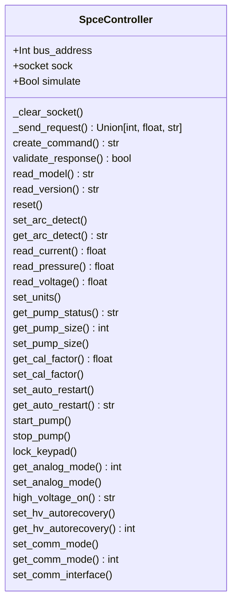

# gammavac_controller

Low-level library for communicating with a Gamma Vacuum SPCe controller

## Currently Supported Models
- SPCe - SPCe.py, SPCe.c, SPCe.h

## Features
- Connect to Gamma Vacuum controllers over serial through a terminal server
- Query state and parameters
- Set individual parameters

## Requirements

- Install base class from https://github.com/COO-Utilities/hardware_device_base

## Installation

```bash
pip install .
```

## Usage

```python
import SPCe

controller = SPCe.SpceController(bus_address=5)
controller.connect(host='192.168.29.100', port=10015)

# Print pressure
print(controller.read_pressure())

# Print pump size
print(controller.get_pump_size())

# Get voltage
controller.read_voltage()

# Get Controller Version
controller.read_version()

# For a comprehensive list of classes and methods, use the help function
help(SPCe)

```

## 🧪 Testing
Unit tests are located in `tests/` directory.

To run all tests from the project root:

```bash
pytest
```

## Class Diagram

Below is a class diagram of the added methods and attributes for the Gamma Vac-Ion.
See the README for the hardware_device_base module for the inherited methods and
attributes.

